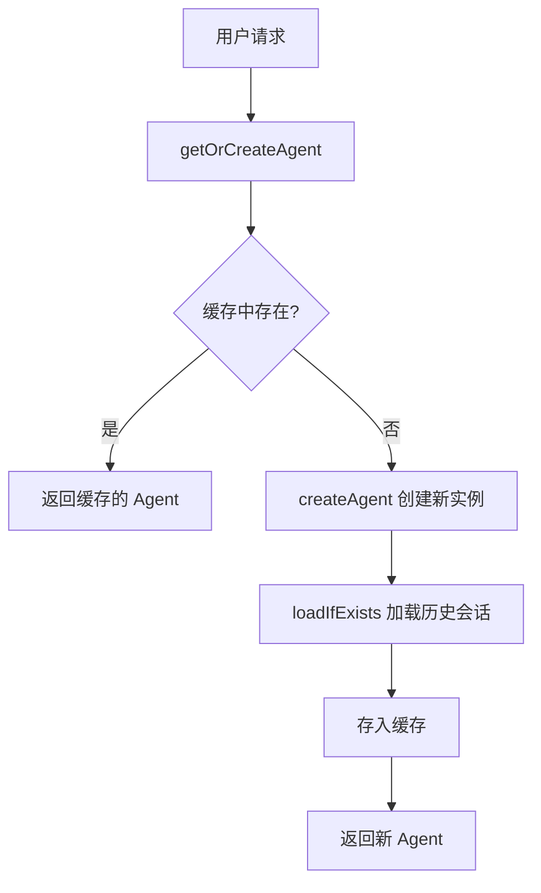
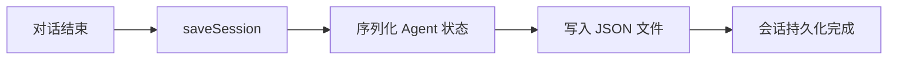

# AgentManager 说明文档

## 概述

`AgentManager` 是 AgentScope 项目中的核心管理器组件，负责 ReActAgent 实例的创建、缓存、会话管理和生命周期控制。它作为 Spring Bean 被管理，为整个应用提供统一的 Agent 访问入口。

**文件位置**: `src/main/java/org/example/manager/AgentManager.java`

## 核心功能

### 1. Agent 实例管理
- **创建**: 根据配置动态创建 ReActAgent 实例
- **缓存**: 使用线程安全的 ConcurrentHashMap 缓存 Agent 实例，避免重复创建
- **获取**: 通过唯一标识符快速获取已存在的 Agent 或创建新实例

### 2. 会话持久化
- **加载**: 自动从磁盘加载历史会话，恢复对话上下文
- **保存**: 将 Agent 的对话历史序列化保存到 JSON 文件
- **存储路径**: `~/.agent-merchant/sessions`

### 3. 多租户支持
- 通过 `userId:sessionId:datasetId` 三元组实现：
  - **用户隔离**: 不同用户的 Agent 实例独立
  - **会话隔离**: 同一用户可以有多个并发会话
  - **数据集隔离**: 支持不同的知识库数据集

## 架构设计

### 依赖组件

```
AgentManager
├── OpenAIChatModel          # 语言模型（由 ChatModelConfig 提供）
├── Toolkit                  # 工具集（包含知识搜索、商品推荐等工具）
├── AnalyticDBConfig         # AnalyticDB 向量数据库配置
├── AnalyticDBVectorStore    # 向量存储服务
└── Session (JsonSession)    # 会话持久化存储
```

### 缓存策略

```
缓存键格式: {userId}:{sessionId}:{datasetId}
示例: user123:session456:dataset789

缓存类型: ConcurrentHashMap<String, ReActAgent>
特性: 
  - 线程安全
  - 懒加载（首次访问时创建）
  - 无过期机制（当前实现）
```

## API 说明

### 构造函数

```java
public AgentManager(
    OpenAIChatModel openAIChatModel,
    Toolkit merchantToolkit,
    AnalyticDBConfig analyticDBConfig,
    AnalyticDBVectorStore vectorStore
)
```

**参数说明**:
- `openAIChatModel`: OpenAI 聊天模型实例
- `merchantToolkit`: 商户工具集，包含所有可用工具
- `analyticDBConfig`: AnalyticDB 配置信息
- `vectorStore`: AnalyticDB 向量存储实例

### 公共方法

#### 1. getOrCreateAgent()

```java
public ReActAgent getOrCreateAgent(String userId, String sessionId, String datasetId)
```

**功能**: 获取或创建 Agent 实例

**参数**:
- `userId`: 用户唯一标识
- `sessionId`: 会话唯一标识
- `datasetId`: 数据集唯一标识（用于区分不同的知识库）

**返回值**: ReActAgent 实例

**行为**:
1. 根据三元组生成缓存键
2. 检查缓存中是否存在
3. 如果存在，直接返回
4. 如果不存在，创建新 Agent 并尝试加载历史会话
5. 将新创建的 Agent 放入缓存
6. 返回 Agent 实例

**使用示例**:
```java
ReActAgent agent = agentManager.getOrCreateAgent("user123", "session001", "dataset001");
```

#### 2. saveSession()

```java
public void saveSession(String sessionId, ReActAgent agent)
```

**功能**: 保存 Agent 的会话状态到磁盘

**参数**:
- `sessionId`: 会话 ID
- `agent`: 要保存的 Agent 实例

**使用示例**:
```java
agentManager.saveSession("session001", agent);
```

### 私有方法

#### createAgent()

```java
private ReActAgent createAgent(String datasetId)
```

**功能**: 创建新的 ReActAgent 实例

**Agent 配置**:
- **名称**: MerchantAssistant
- **系统提示**: 店铺助手角色定义
- **模型**: 注入的 OpenAIChatModel
- **工具集**: merchantToolkit（包含 knowledge_search、product_recommendation 等）
- **内存**: InMemoryMemory（内存存储对话历史）
- **钩子**: LoggingHook（日志记录）
- **最大迭代次数**: 10

**可用工具**:
1. `knowledge_search` - 从知识库中搜索相关信息
2. `product_recommendation` - 推荐商品
3. `read_file/write_file` - 文件操作

## 工作流程

### Agent 获取流程



### 会话保存流程



## 配置说明

### 会话存储路径

默认路径: `~/.agent-merchant/sessions`

可以通过修改构造函数中的 Path 配置来更改：
```java
this.session = new JsonSession(Path.of("自定义路径"));
```

### Agent 配置

在 `createAgent()` 方法中可以调整以下配置：

```java
ReActAgent.builder()
    .name("MerchantAssistant")           // Agent 名称
    .sysPrompt("...")                     // 系统提示词
    .model(openAIChatModel)              // 语言模型
    .toolkit(merchantToolkit)            // 工具集
    .memory(new InMemoryMemory())        // 内存类型
    .hook(new LoggingHook())             // 钩子
    .maxIters(10);                       // 最大迭代次数
```

## 扩展建议

### 1. 缓存过期策略

当前实现没有缓存过期机制，可以考虑添加：
```java
// 使用 Caffeine 或 Guava Cache 替代 ConcurrentHashMap
Cache<String, ReActAgent> cache = Caffeine.newBuilder()
    .expireAfterAccess(30, TimeUnit.MINUTES)
    .maximumSize(1000)
    .build();
```

### 2. 缓存清理

添加手动清理方法：
```java
public void clearCache(String userId) {
    agentCache.keySet().removeIf(key -> key.startsWith(userId + ":"));
}
```

### 3. 监控指标

添加 Agent 创建和命中率统计：
```java
private final AtomicInteger cacheHits = new AtomicInteger(0);
private final AtomicInteger cacheMisses = new AtomicInteger(0);
```

### 4. 会话压缩

对于长期运行的会话，可以考虑定期压缩或归档旧会话。

## 注意事项

1. **线程安全**: 使用 `ConcurrentHashMap` 保证并发访问安全
2. **内存占用**: 每个 Agent 实例会占用一定内存，大量用户时需关注内存使用
3. **会话文件**: 定期清理过期的会话文件，避免磁盘空间占用过大
4. **datasetId 用途**: 当前实现中 datasetId 主要用于缓存键区分，实际的知识库检索通过 KnowledgeSearchTool 自动处理

## 相关组件

- [AgentManager](file:///Users/zhaonanjian/Documents/workspace/AgentScope-test/src/main/java/org/example/manager/AgentManager.java) - Agent 管理器（本文档）
- [LoggingHook](file:///Users/zhaonanjian/Documents/workspace/AgentScope-test/src/main/java/org/example/hook/LoggingHook.java) - 日志钩子
- [KnowledgeSearchTool](file:///Users/zhaonanjian/Documents/workspace/AgentScope-test/src/main/java/org/example/tool/KnowledgeSearchTool.java) - 知识搜索工具
- [AnalyticDBVectorStore](file:///Users/zhaonanjian/Documents/workspace/AgentScope-test/src/main/java/org/example/knowledge/AnalyticDBVectorStore.java) - 向量存储
- [ChatServiceImpl](file:///Users/zhaonanjian/Documents/workspace/AgentScope-test/src/main/java/org/example/service/impl/ChatServiceImpl.java) - 聊天服务实现（使用 AgentManager）

## 版本历史

- **初始版本**: 实现基本的 Agent 创建、缓存和会话管理功能
- **集成 AnalyticDB**: 通过 KnowledgeSearchTool 集成向量数据库检索能力
